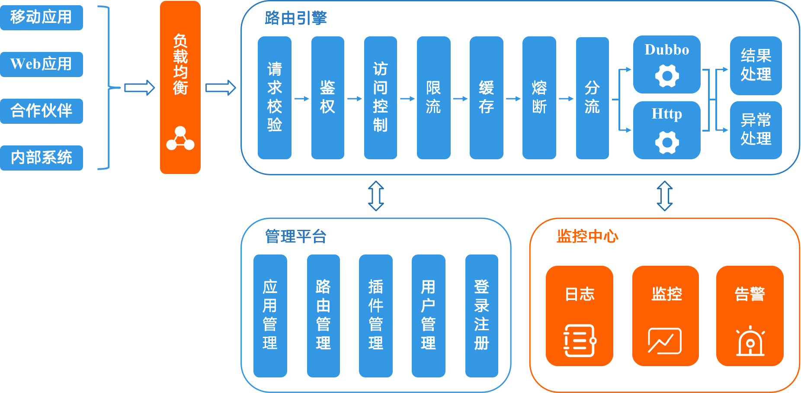

# 1 系统设计
## 1.1 技术栈
**网络**: Netty  
**RPC**: Dubbo  
**注册中心**: Zookeeper  
**HTTP转发**: HttpClient  
**限流**: Guava、Redis  
**熔断**: Sentinel  

## 1.2 系统架构


## 1.3 功能
请求校验、负载均衡、白名单、黑名单、鉴权、限流、缓存  
协议转发(Http => Dubbo, Http => Http)  
熔断降级

# 2 启动
## 2.1 zookeeper配置
### 官网下载
https://www.apache.org/dyn/closer.lua/zookeeper/zookeeper-3.6.3/apache-zookeeper-3.6.3-bin.tar.gz

### 启动
服务器启动 [path to zookeeper]/bin/zkServer.sh start  
服务器关闭 [path to zookeeper]/bin/zkServer.sh stop  
客户端启动 [path to zookeeper]/bin/zkCli.sh  
   
## 2.2 redis配置
### 安装
> brew安装的文件在/usr/local/Cellar下

brew install redis

### 启动
> redis默认不是后台启动，需要将 /usr/local/etc/redis.conf 中 GENERAL 下的 daemonize 修改为 yes
> daemon 为守护进程，改为 yes 后redis后台启动

```shell
redis-server /usr/local/etc/redis.conf
```

## 2.3 MySQL配置
运行docs中的sql文件

## 2.4 设置环境变量
在 gateway-common 的 LocalEnvUtil 中设置自己的本地环境变量

## 2.5 运行
启动 gateway-admin 中的 Application  
启动 gateway-dubbo-demo 中的 GatewayDubboDemoApplication

# 参考资料

美团：https://tech.meituan.com/2021/05/20/shepherd-api-gateway.html
有赞：https://tech.youzan.com/api-gateway-in-practice/